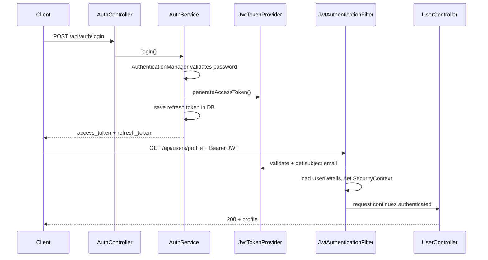

# Authentication and Authorization

This document explains **how authentication and authorization work** in this application: login, JWTs, refresh tokens, Spring Security filters, and **authorization** (who can call which API).

---

## 1. Terms

| Term | Meaning here |
|------|----------------|
| **Authentication** | Proving *who you are* (email + password at login, or a valid JWT afterward). |
| **Authorization** | Deciding *what you are allowed to do* after you are authenticated (e.g. only `ROLE_ADMIN` can change roles). |
| **Access token** | Short-lived **JWT** proving identity for API calls. Sent as `Authorization: Bearer <token>`. |
| **Refresh token** | Long-lived **opaque token** stored in DB; used to obtain a new access token without password. |

---

## 2. High-level flow

---

## 3. Authentication pieces (code map)

### 3.1 Login and tokens

| Component | File | Role |
|-----------|------|------|
| Login/register/refresh/logout | `controller/AuthController.java` | HTTP endpoints under `/api/auth`. |
| Orchestration | `service/AuthService.java` | Calls `AuthenticationManager` for login; issues JWT and refresh token; refresh rotation; logout clears refresh tokens. |
| JWT create/parse | `security/JwtTokenProvider.java` | Signs access JWT with `app.jwt.secret` (Base64), HS512; sets subject to user email; validates expiry and signature. |
| Refresh storage | `service/RefreshTokenService.java`, `entity/RefreshToken.java`, `repository/RefreshTokenRepository.java` | UUID refresh tokens in DB; delete on logout or on refresh (rotation). |
| Password hashing | `config/PasswordEncoderConfig.java` | `BCryptPasswordEncoder(12)` bean. |
| User lookup for Spring Security | `service/UserService.java` | Implements `UserDetailsService`; loads user by email and exposes `GrantedAuthority` from `Role` enum. |

### 3.2 Validating JWT on each request

| Component | File | Role |
|-----------|------|------|
| Filter | `security/JwtAuthenticationFilter.java` | Reads `Authorization: Bearer ...`, validates JWT, loads user, sets `SecurityContextHolder`. |
| Entry point | `security/JwtAuthEntryPoint.java` | Returns JSON **401** when a protected route is hit without valid authentication. |

### 3.3 Security configuration

| Component | File | Role |
|-----------|------|------|
| Filter chain | `config/SecurityConfig.java` | CSRF off; **stateless** sessions; JWT filter before `UsernamePasswordAuthenticationFilter`; **permitAll** for `/api/auth/**`, Swagger, health; **authenticated** for the rest. |
| Method security | `config/SecurityConfig.java` | `@EnableMethodSecurity` enables `@PreAuthorize` on controllers. |

---

## 4. Authorization (roles)

### 4.1 Roles

**File:** `entity/Role.java`

- `ROLE_USER` — default after registration.
- `ROLE_ADMIN` — full admin operations where restricted.

Spring Security’s `hasRole('ADMIN')` expects authorities named `ROLE_ADMIN` (the `ROLE_` prefix is part of the convention).

### 4.2 Where roles are enforced

| Mechanism | Example |
|-----------|---------|
| **JWT + UserDetails** | At login, `UserService.loadUserByUsername` attaches `SimpleGrantedAuthority(user.getRole().name())`. The JWT filter rebuilds the security context so `@PreAuthorize` sees the same roles. |
| **@PreAuthorize** | `UserController`: e.g. `hasRole('ADMIN')` on admin-only routes or role change endpoint. |

### 4.3 Bootstrap admin

**File:** `config/DataInitializer.java`

On startup, if `admin@authapp.local` does not exist, it creates an admin user (password documented in logs / project docs). That gives you a first **ROLE_ADMIN** account to promote others or use admin APIs.

---

## 5. Public vs protected routes

Configured in `SecurityConfig`:

- **Public (no JWT):** `/api/auth/**` (register, login, refresh, forgot-password, reset-password), Swagger, actuator health.
- **Protected (JWT required):** e.g. `/api/users/**`, `/api/auth/logout`.
- **Admin only:** `GET /api/users` (list all users), `PUT /api/users/{id}/role`, and other routes annotated with `hasRole('ADMIN')`.

Forgot/reset password must stay public so users who forgot credentials can still reach them.

---

## 6. Forgot password vs JWT auth

- **Forgot / reset** uses **email + OTP** stored in `password_reset_tokens`, not JWT. See [forgot-password-implementation.md](forgot-password-implementation.md).
- After reset, the user **authenticates again** with `POST /api/auth/login` to receive new access and refresh tokens.

---

## 7. Configuration properties

| Property | Typical use |
|----------|-------------|
| `app.jwt.secret` | Base64-encoded key for signing JWTs. |
| `app.jwt.access-token-expiry-ms` | Access token lifetime. |
| `app.jwt.refresh-token-expiry-ms` | Refresh token lifetime. |
| `app.aws.endpoint` | Set to LocalStack URL in Docker for SES/S3/SSM clients. |

Profiles: `application-local.yml`, `application-docker.yml` under `src/main/resources/`.

---

## 8. Further reading

| Document | Content |
|----------|---------|
| [forgot-password-implementation.md](forgot-password-implementation.md) | OTP, SES, reset API steps |
| [AUTHENTICATION.md](../AUTHENTICATION.md) | Full API examples and deep dive |
| [RUNNING.md](../RUNNING.md) | Run with Docker Compose or locally |
